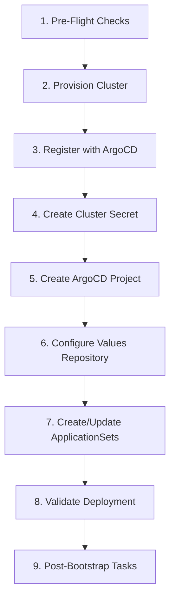

# ArgoCD Cluster Bootstrapping Workflow

Complete step-by-step workflow for bootstrapping a new Kubernetes cluster into the ArgoCD-managed GitOps environment.

## Overview



---

## Phase 1: Pre-Flight Checks

### 1.1 Verify Prerequisites

```bash
# Required tools
argocd version --client    # ArgoCD CLI
kubectl version --client   # Kubernetes CLI
helm version              # Helm CLI
git --version             # Git CLI

# Required access
az account show           # Azure CLI logged in
```

### 1.2 Verify Hub Cluster Access

```bash
# Switch to hub cluster context
kubectl config use-context aks-cafehyna-default

# Verify ArgoCD is running
kubectl get pods -n argocd -l app.kubernetes.io/name=argocd-server

# Login to ArgoCD
argocd login argocd.example.com --sso
```

### 1.3 Gather Required Information

| Information | Example | Source |
|-------------|---------|--------|
| Cluster Name | `cafehyna-dev-02` | Naming convention |
| Azure Resource Group | `rg-cafehyna-dev-02` | Azure Portal |
| Region | `brazilsouth` | Azure region code |
| Environment | `dev` | dev/hlg/prd |
| Node Type | `spot` | spot/standard/mixed |
| Subscription ID | `xxxxxxxx-xxxx-xxxx-xxxx-xxxxxxxxxxxx` | Azure Portal |

---

## Phase 2: Provision Cluster (if new)

### 2.1 Azure AKS Provisioning

```bash
# Using Azure CLI (example)
az aks create \
  --resource-group rg-cafehyna-dev-02 \
  --name aks-cafehyna-dev-02 \
  --location brazilsouth \
  --node-count 3 \
  --node-vm-size Standard_D4s_v3 \
  --enable-managed-identity \
  --network-plugin azure \
  --network-policy calico \
  --kubernetes-version 1.28.5 \
  --tags environment=dev tier=application
```

### 2.2 Get Cluster Credentials

```bash
# Download kubeconfig
az aks get-credentials \
  --resource-group rg-cafehyna-dev-02 \
  --name aks-cafehyna-dev-02 \
  --admin

# Verify access
kubectl get nodes
```

### 2.3 Install Required Components

```bash
# Install cert-manager (if not using ApplicationSet)
kubectl apply -f https://github.com/cert-manager/cert-manager/releases/download/v1.14.0/cert-manager.yaml

# Install external-secrets operator (if not using ApplicationSet)
helm repo add external-secrets https://charts.external-secrets.io
helm install external-secrets external-secrets/external-secrets -n external-secrets --create-namespace
```

---

## Phase 3: Register Cluster with ArgoCD

### 3.1 Add Cluster to ArgoCD

```bash
# Switch to hub cluster context first
kubectl config use-context aks-cafehyna-default

# Get the new cluster's context name
kubectl config get-contexts

# Add cluster (creates service account and cluster role)
argocd cluster add aks-cafehyna-dev-02 \
  --name cafehyna-dev-02 \
  --kubeconfig ~/.kube/config \
  --yes

# Verify registration
argocd cluster list
```

### 3.2 Verify Connectivity

```bash
# Check cluster status
argocd cluster get cafehyna-dev-02

# Expected output should show:
# - Connection State: Successful
# - Server Version: v1.28.x
```

---

## Phase 4: Create Cluster Secret (GitOps)

### 4.1 Create Cluster Secret File

Create file: `infra-team/argocd-clusters/cafehyna-dev-02.yaml`

```yaml
apiVersion: v1
kind: Secret
metadata:
  name: cafehyna-dev-02
  namespace: argocd
  labels:
    argocd.argoproj.io/secret-type: cluster
    # Targeting labels (used by ApplicationSets)
    environment: dev
    region: brazilsouth
    cluster-name: cafehyna-dev-02
    node-type: spot
    connection-type: internal
    tier: application
type: Opaque
stringData:
  name: cafehyna-dev-02
  server: https://aks-cafehyna-dev-02-xxxxxx.hcp.brazilsouth.azmk8s.io:443
  config: |
    {
      "execProviderConfig": {
        "command": "argocd-k8s-auth",
        "args": ["azure", "--cluster-name", "aks-cafehyna-dev-02"],
        "apiVersion": "client.authentication.k8s.io/v1beta1"
      },
      "tlsClientConfig": {
        "insecure": false,
        "caData": "<base64-encoded-ca-cert>"
      }
    }
```

### 4.2 Commit and Push

```bash
cd infra-team
git checkout -b feat/add-cluster-cafehyna-dev-02
git add argocd-clusters/cafehyna-dev-02.yaml
git commit -m "feat(cluster): add cafehyna-dev-02 cluster registration"
git push origin feat/add-cluster-cafehyna-dev-02
```

---

## Phase 5: Create ArgoCD Project

### 5.1 Create Project Definition

Create file: `infra-team/argocd-projects/cafehyna-dev-02.yaml`

```yaml
apiVersion: argoproj.io/v1alpha1
kind: AppProject
metadata:
  name: cafehyna-dev-02
  namespace: argocd
  finalizers:
    - resources-finalizer.argocd.argoproj.io
spec:
  description: "Cafehyna Dev 02 Cluster Project"

  # Source repositories
  sourceRepos:
    - 'https://github.com/org/infra-team.git'
    - 'https://github.com/org/argo-cd-helm-values.git'
    - 'https://charts.bitnami.com/bitnami'
    - 'https://prometheus-community.github.io/helm-charts'

  # Destination clusters and namespaces
  destinations:
    - namespace: '*'
      server: https://aks-cafehyna-dev-02-xxxxxx.hcp.brazilsouth.azmk8s.io:443
      name: cafehyna-dev-02

  # Cluster resource whitelist
  clusterResourceWhitelist:
    - group: '*'
      kind: '*'

  # Namespace resource whitelist
  namespaceResourceWhitelist:
    - group: '*'
      kind: '*'

  # Orphaned resources monitoring
  orphanedResources:
    warn: true

  # Sync windows (optional - for production)
  # syncWindows:
  #   - kind: allow
  #     schedule: '0 8-18 * * 1-5'
  #     duration: 10h
  #     applications:
  #       - '*'
```

### 5.2 Commit and Push

```bash
git add argocd-projects/cafehyna-dev-02.yaml
git commit -m "feat(project): add ArgoCD project for cafehyna-dev-02"
git push origin feat/add-cluster-cafehyna-dev-02
```

---

## Phase 6: Configure Values Repository

### 6.1 Create Base Values Structure

```bash
# In argo-cd-helm-values repository
mkdir -p kube-addons/cert-manager/cafehyna-dev-02
mkdir -p kube-addons/external-secrets/cafehyna-dev-02
mkdir -p kube-addons/ingress-nginx/cafehyna-dev-02
mkdir -p kube-addons/prometheus-stack/cafehyna-dev-02
```

### 6.2 Create Component Values

Example: `kube-addons/ingress-nginx/cafehyna-dev-02/values.yaml`

```yaml
# Ingress NGINX configuration for cafehyna-dev-02
controller:
  replicaCount: 1  # Dev uses single replica

  # Spot instance tolerations (dev only)
  tolerations:
    - key: "kubernetes.azure.com/scalesetpriority"
      operator: "Equal"
      value: "spot"
      effect: "NoSchedule"

  # Node selector for spot instances
  nodeSelector:
    kubernetes.azure.com/scalesetpriority: spot

  # Resource limits (dev - reduced)
  resources:
    requests:
      cpu: 100m
      memory: 128Mi
    limits:
      cpu: 500m
      memory: 512Mi

  # Service configuration
  service:
    type: LoadBalancer
    annotations:
      service.beta.kubernetes.io/azure-load-balancer-internal: "true"
```

### 6.3 Commit Values

```bash
cd argo-cd-helm-values
git checkout -b feat/add-values-cafehyna-dev-02
git add kube-addons/*/cafehyna-dev-02/
git commit -m "feat(values): add component values for cafehyna-dev-02"
git push origin feat/add-values-cafehyna-dev-02
```

---

## Phase 7: Update ApplicationSets

### 7.1 Verify Cluster Targeting

Check if existing ApplicationSets will target the new cluster:

```yaml
# Example: ApplicationSet with cluster generator
spec:
  generators:
    - clusters:
        selector:
          matchLabels:
            environment: dev  # New cluster has this label
            tier: application
```

### 7.2 Create Cluster-Specific ApplicationSet (if needed)

If custom ApplicationSet is required:

```yaml
apiVersion: argoproj.io/v1alpha1
kind: ApplicationSet
metadata:
  name: cafehyna-dev-02-apps
  namespace: argocd
spec:
  generators:
    - clusters:
        selector:
          matchLabels:
            cluster-name: cafehyna-dev-02
  template:
    metadata:
      name: '{{name}}-app'
    spec:
      project: cafehyna-dev-02
      sources:
        - repoURL: https://github.com/org/infra-team.git
          targetRevision: main
          path: helm-charts/my-app
        - repoURL: https://github.com/org/argo-cd-helm-values.git
          targetRevision: main
          path: kube-addons/my-app/{{name}}
          helm:
            valueFiles:
              - values.yaml
      destination:
        server: '{{server}}'
        namespace: my-app
      syncPolicy:
        automated:
          prune: true
          selfHeal: true
```

---

## Phase 8: Validate Deployment

### 8.1 Check ArgoCD UI

1. Open ArgoCD UI: `https://argocd.example.com`
2. Navigate to Settings → Clusters
3. Verify new cluster shows "Connected"
4. Check Applications are syncing

### 8.2 Command Line Validation

```bash
# List all apps on new cluster
argocd app list --dest-server https://aks-cafehyna-dev-02-*.hcp.brazilsouth.azmk8s.io:443

# Check specific app status
argocd app get ingress-nginx-cafehyna-dev-02

# Sync an application manually
argocd app sync ingress-nginx-cafehyna-dev-02
```

### 8.3 Verify Workloads

```bash
# Switch to new cluster
kubectl config use-context aks-cafehyna-dev-02

# Check all namespaces
kubectl get namespaces

# Check running pods
kubectl get pods -A

# Check services
kubectl get svc -A
```

---

## Phase 9: Post-Bootstrap Tasks

### 9.1 Configure Monitoring

```bash
# Verify Prometheus is scraping
kubectl port-forward -n monitoring svc/prometheus-server 9090:80

# Check targets at http://localhost:9090/targets
```

### 9.2 Configure Logging

```bash
# Verify Loki is receiving logs
kubectl logs -n logging -l app=loki --tail=100
```

### 9.3 Configure Alerting

Add cluster-specific alert rules:

```yaml
# In argo-cd-helm-values/kube-addons/prometheus-stack/cafehyna-dev-02/values.yaml
additionalPrometheusRules:
  - name: cluster-alerts
    groups:
      - name: cluster
        rules:
          - alert: HighPodRestarts
            expr: increase(kube_pod_container_status_restarts_total[1h]) > 5
            labels:
              severity: warning
              cluster: cafehyna-dev-02
```

### 9.4 Update Documentation

Update cluster inventory documentation:

```markdown
## Cluster: cafehyna-dev-02

| Property | Value |
|----------|-------|
| Environment | Development |
| Region | Brazil South |
| Kubernetes Version | 1.28.5 |
| Node Type | Spot Instances |
| Bootstrap Date | 2024-01-15 |
| Owner | Platform Team |
```

### 9.5 Create Runbook

Document cluster-specific procedures in `docs/clusters/cafehyna-dev-02.md`.

---

## Rollback Procedure

If bootstrap fails, execute rollback:

```bash
# 1. Remove from ArgoCD
argocd cluster rm cafehyna-dev-02

# 2. Delete cluster secret
kubectl delete secret cafehyna-dev-02 -n argocd

# 3. Delete project
kubectl delete appproject cafehyna-dev-02 -n argocd

# 4. Revert Git commits
git revert HEAD~3  # Adjust based on number of commits

# 5. (Optional) Delete AKS cluster
az aks delete --resource-group rg-cafehyna-dev-02 --name aks-cafehyna-dev-02 --yes
```

---

## Checklist

```markdown
## Bootstrap Checklist for: _______________

### Pre-Flight
- [ ] ArgoCD CLI installed and logged in
- [ ] kubectl access to hub cluster verified
- [ ] Cluster information gathered
- [ ] Naming convention confirmed

### Registration
- [ ] AKS cluster provisioned
- [ ] Cluster added to ArgoCD (`argocd cluster add`)
- [ ] Connectivity verified

### Configuration (GitOps)
- [ ] Cluster secret created and committed
- [ ] ArgoCD Project created and committed
- [ ] Values files created for all components
- [ ] PRs approved and merged

### Validation
- [ ] Cluster shows "Connected" in ArgoCD UI
- [ ] ApplicationSets targeting cluster
- [ ] At least one app successfully synced
- [ ] Monitoring operational
- [ ] Logging operational

### Documentation
- [ ] Cluster inventory updated
- [ ] Runbook created
- [ ] Team notified
```
