# MkDocs Diagrams Guide

Complete guide to adding diagrams and visualizations to MkDocs documentation.

## Native Mermaid (Material Theme)

Material for MkDocs has built-in Mermaid support - no additional plugins needed.

### Configuration

```yaml
# mkdocs.yml
theme:
  name: material

markdown_extensions:
  - pymdownx.superfences:
      custom_fences:
        - name: mermaid
          class: mermaid
          format: !!python/name:pymdownx.superfences.fence_code_format
```

### Flowcharts

````markdown
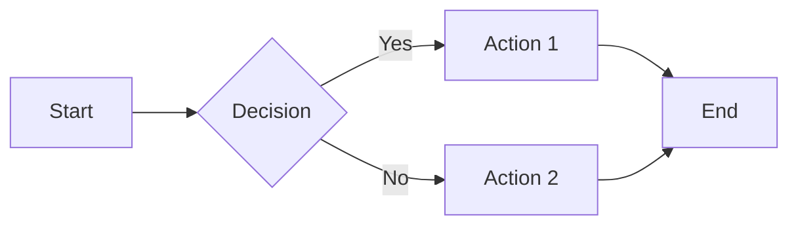
````

**Direction Options:**
- `TB` or `TD` - Top to Bottom
- `BT` - Bottom to Top
- `LR` - Left to Right
- `RL` - Right to Left

### Sequence Diagrams

````markdown
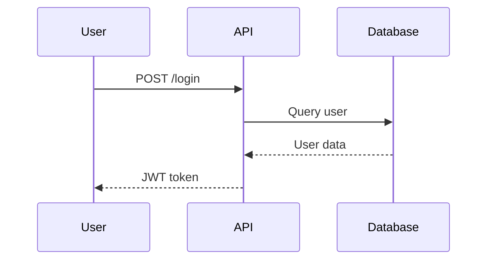
````

### Class Diagrams

````markdown
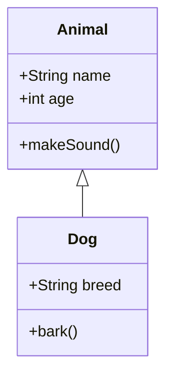
````

### State Diagrams

````markdown
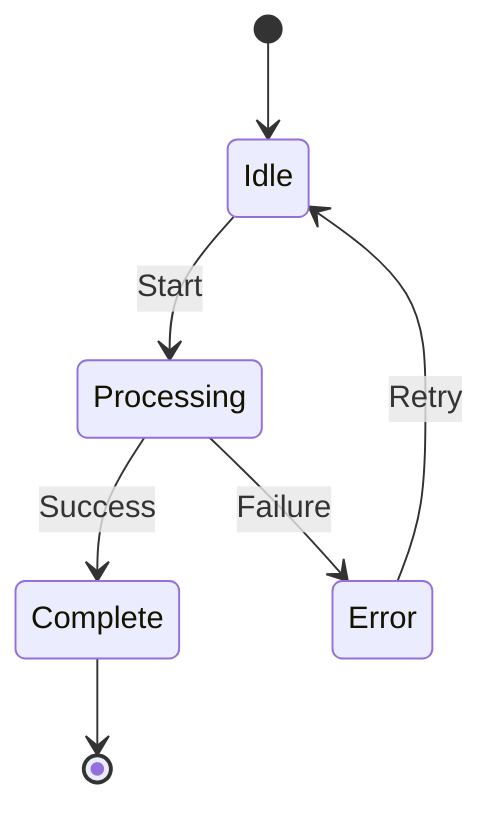
````

### Entity Relationship Diagrams

````markdown
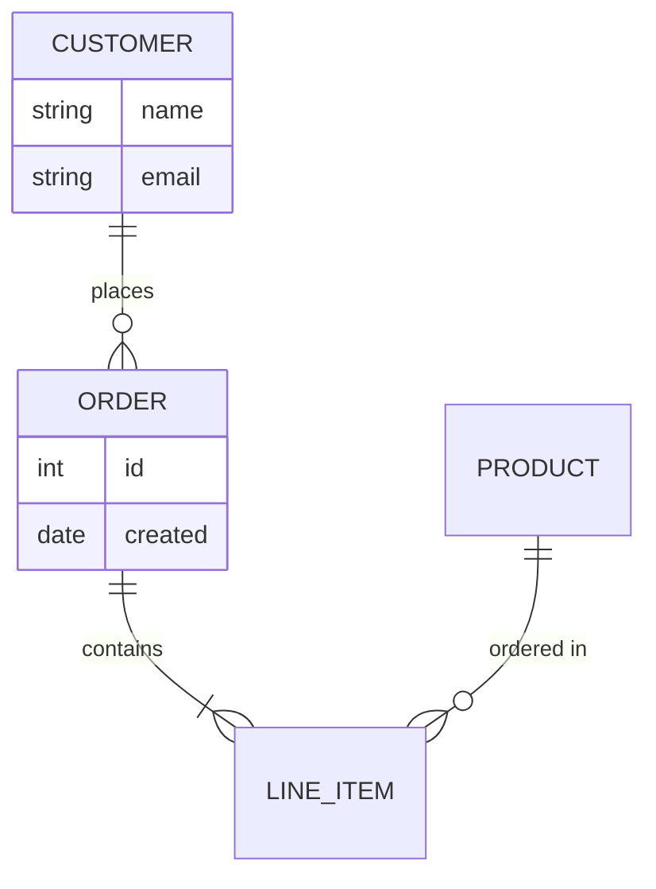
````

### Gantt Charts

````markdown
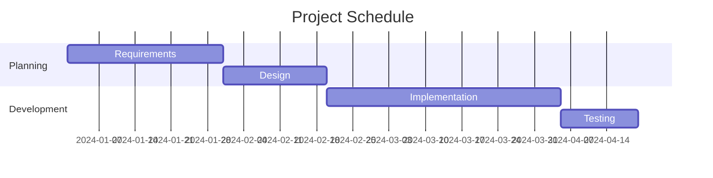
````

### Pie Charts

````markdown
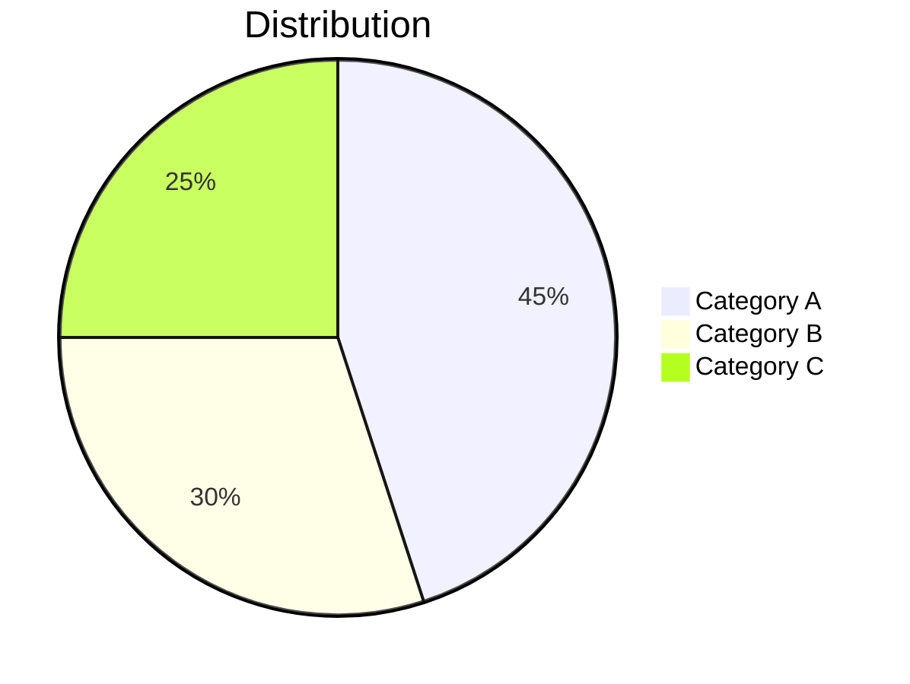
````

### Git Graphs

````markdown
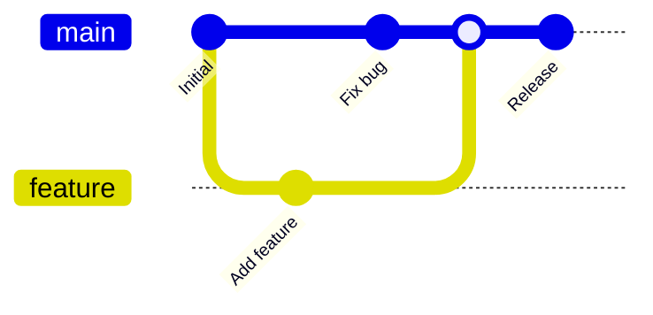
````

### User Journey

````markdown
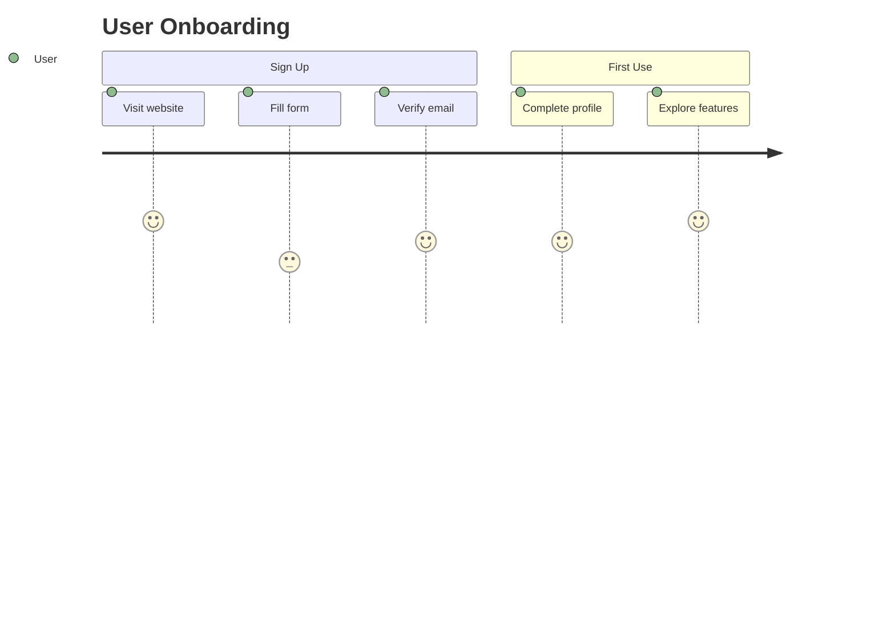
````

## mkdocs-mermaid2-plugin

Standalone Mermaid plugin for themes without native support.

### Installation

```bash
pip install mkdocs-mermaid2-plugin
```

### Configuration

```yaml
plugins:
  - mermaid2:
      version: 10.6.0
      arguments:
        theme: 'dark'
        securityLevel: 'loose'

extra_javascript:
  - https://unpkg.com/mermaid/dist/mermaid.min.js
```

## Kroki (PlantUML, C4, 20+ Diagram Types)

Kroki supports 20+ diagram types via a unified API.

### Installation

```bash
pip install mkdocs-kroki-plugin
```

### Configuration

```yaml
plugins:
  - kroki:
      ServerURL: https://kroki.io
      EnableBlockDiag: true
      EnableExcalidraw: true
      DownloadImages: false
      DownloadDir: docs/images/kroki
```

### PlantUML Diagrams

````markdown
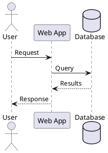
````

### C4 Architecture Diagrams

````markdown
```c4plantuml
@startuml
!include https://raw.githubusercontent.com/plantuml-stdlib/C4-PlantUML/master/C4_Container.puml

Person(user, "User", "A user of the system")
System_Boundary(system, "System") {
    Container(web, "Web App", "React", "Frontend")
    Container(api, "API", "Python", "Backend")
    ContainerDb(db, "Database", "PostgreSQL", "Data storage")
}

Rel(user, web, "Uses")
Rel(web, api, "Calls")
Rel(api, db, "Reads/Writes")
@enduml
```
````

### BlockDiag

````markdown
```blockdiag
blockdiag {
    A -> B -> C -> D;
    A -> E -> F -> D;
}
```
````

### Network Diagrams

````markdown
```nwdiag
nwdiag {
    network dmz {
        address = "210.x.x.x/24"
        web01 [address = "210.x.x.1"];
        web02 [address = "210.x.x.2"];
    }
    network internal {
        address = "172.x.x.x/24";
        web01 [address = "172.x.x.1"];
        db01;
    }
}
```
````

### Supported Diagram Types

| Type | Code Block | Description |
|------|------------|-------------|
| PlantUML | `plantuml` | UML, C4, Archimate |
| Mermaid | `mermaid` | Various diagrams |
| BlockDiag | `blockdiag` | Block diagrams |
| SeqDiag | `seqdiag` | Sequence diagrams |
| ActDiag | `actdiag` | Activity diagrams |
| NwDiag | `nwdiag` | Network diagrams |
| PacketDiag | `packetdiag` | Packet structure |
| RackDiag | `rackdiag` | Server racks |
| ERD | `erd` | Entity-Relationship |
| GraphViz | `graphviz` | Graph visualization |
| Ditaa | `ditaa` | ASCII art diagrams |
| Nomnoml | `nomnoml` | UML-like diagrams |
| Vega | `vega` | Data visualization |
| Vega-Lite | `vegalite` | Simple charts |
| WaveDrom | `wavedrom` | Digital timing |
| Bytefield | `bytefield` | Byte/bit fields |
| Excalidraw | `excalidraw` | Hand-drawn style |
| BPMN | `bpmn` | Business process |
| Structurizr | `structurizr` | C4 model DSL |

## D2 Diagrams

D2 is a modern declarative diagramming language.

### Installation

```bash
pip install mkdocs-d2-plugin
```

**Requires D2 CLI:**
```bash
# macOS
brew install d2

# Linux
curl -fsSL https://d2lang.com/install.sh | sh
```

### Configuration

```yaml
plugins:
  - d2:
      executable: d2
      theme: 0
      layout: dagre
      sketch: false
      pad: 100
```

### Basic D2 Diagram

````markdown
```d2
direction: right
client -> server: request
server -> database: query
database -> server: results
server -> client: response
```
````

### D2 with Styling

````markdown
```d2
direction: down

User: {
  shape: person
}

Web App: {
  style.fill: "#e8f4ea"
}

Database: {
  shape: cylinder
  style.fill: "#ffeeba"
}

User -> Web App: HTTP
Web App -> Database: SQL
```
````

### D2 Containers

````markdown
```d2
AWS: {
  VPC: {
    Public Subnet: {
      ALB
    }
    Private Subnet: {
      ECS
      RDS: {shape: cylinder}
    }

    ALB -> ECS
    ECS -> RDS
  }
}
```
````

## Pan & Zoom for Diagrams

Enable pan and zoom on diagrams and images.

### Installation

```bash
pip install mkdocs-panzoom
```

### Configuration

```yaml
plugins:
  - panzoom:
      selector: "img, svg, .mermaid"
      full_screen: true
      zoom_button: true
```

## Material Theme Diagram Recommendations

For Material for MkDocs, use this recommended setup:

```yaml
theme:
  name: material
  features:
    - content.code.copy

markdown_extensions:
  - pymdownx.superfences:
      custom_fences:
        - name: mermaid
          class: mermaid
          format: !!python/name:pymdownx.superfences.fence_code_format

# For additional diagram types
plugins:
  - kroki:
      ServerURL: https://kroki.io
```

## Self-Hosted Kroki

For enterprise/offline use, self-host Kroki:

```yaml
# docker-compose.yml
services:
  kroki:
    image: yuzutech/kroki
    ports:
      - "8000:8000"
    environment:
      - KROKI_MERMAID_HOST=mermaid
      - KROKI_BPMN_HOST=bpmn
  mermaid:
    image: yuzutech/kroki-mermaid
  bpmn:
    image: yuzutech/kroki-bpmn
```

```yaml
# mkdocs.yml
plugins:
  - kroki:
      ServerURL: http://localhost:8000
      DownloadImages: true
      DownloadDir: docs/images/diagrams
```

## Best Practices

### Keep Diagrams Simple
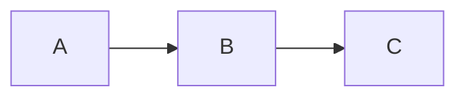
- Limit nodes to 10-15 per diagram
- Use clear, short labels
- Break complex systems into multiple diagrams

### Use Meaningful Colors

````markdown
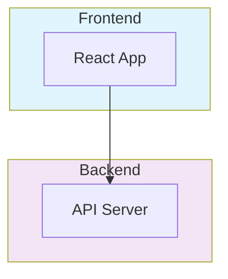
````

### Add Context with Titles

````markdown
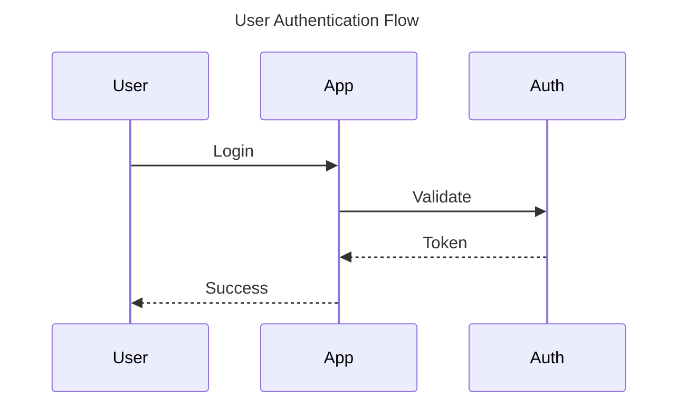
````

### Version Control

- Store diagram source in Markdown (not images)
- Diagrams as code enables diffs and history
- Self-hosted Kroki caches images for reproducibility

## Comparison Table

| Feature | Native Mermaid | Mermaid2 Plugin | Kroki | D2 |
|---------|---------------|-----------------|-------|-----|
| Setup | Easy | Medium | Medium | Medium |
| Diagram Types | 10+ | 10+ | 20+ | 10+ |
| PlantUML | No | No | Yes | No |
| C4 Diagrams | Limited | Limited | Yes | Yes |
| Offline | Yes | Yes | Needs server | Yes |
| Performance | Fast | Fast | Network | Fast |
| Material Theme | Built-in | Works | Works | Works |
