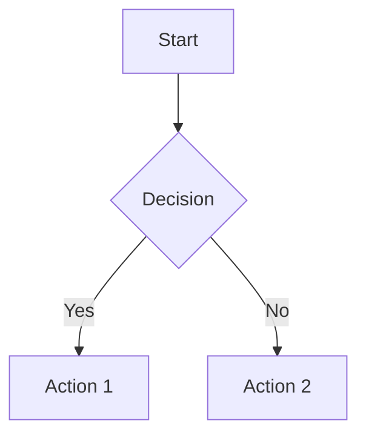
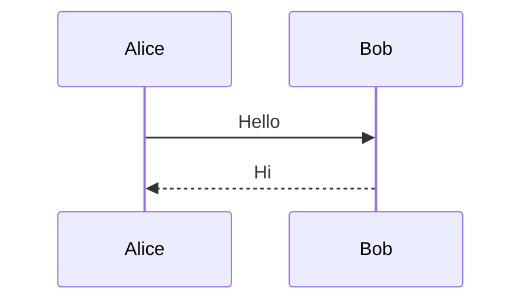

# Obsidian Flavored Markdown Reference

Obsidian uses CommonMark + GitHub Flavored Markdown + LaTeX + Obsidian extensions.

## Basic Formatting

| Style | Syntax | Result |
|-------|--------|--------|
| Bold | `**text**` | **Bold** |
| Italic | `*text*` | *Italic* |
| Bold+Italic | `***text***` | ***Both*** |
| Strikethrough | `~~text~~` | ~~Striked~~ |
| Highlight | `==text==` | ==Highlighted== |
| Inline code | `` `code` `` | `code` |

Escape with backslash: `\*`, `\_`, `\#`, `` \` ``, `\|`, `\~`

## Internal Links (Wikilinks)

```markdown
[[Note Name]]                    # Link to note
[[Note Name|Display Text]]       # Link with alias
[[Note Name#Heading]]            # Link to heading
[[Note Name#^block-id]]          # Link to block
[[#Heading in same note]]        # Same-file heading link
[[##heading]]                    # Search headings in vault
[[^^block]]                      # Search blocks in vault
```

## Markdown-Style Links

```markdown
[Display Text](Note%20Name.md)           # Spaces must be URL-encoded
[Display Text](Note%20Name.md#Heading)
[Display Text](https://example.com)
[Note](obsidian://open?vault=VaultName&file=Note.md)
```

## Embeds (Transclusion)

```markdown
![[Note Name]]                   # Embed entire note
![[Note Name#Heading]]           # Embed section
![[Note Name#^block-id]]         # Embed block
![[image.png]]                   # Embed image
![[image.png|300]]               # Width only
![[image.png|300x200]]           # Width x Height
![[audio.mp3]]                   # Embed audio
![[video.mp4]]                   # Embed video
![[document.pdf]]                # Embed PDF
![[document.pdf#page=3]]         # Embed PDF page
```

### External Images

```markdown


```

### Embed Search Results

````markdown
```query
tag:#project status:done
```
````

## Block References

```markdown
This is a paragraph. ^block-id

# Reference from another note:
[[Note#^block-id]]
![[Note#^block-id]]
```

For lists/quotes, add block ID on separate line after the block:
```markdown
- Item 1
- Item 2

^list-id
```

## Callouts

```markdown
> [!note] Title
> Content

> [!tip]+ Expandable (default open)
> Click to collapse

> [!info]- Collapsed (default closed)
> Click to expand
```

### Nested Callouts

```markdown
> [!question] Outer
> > [!note] Inner
> > Nested content
```

### Callout Types

| Type | Aliases |
|------|---------|
| `note` | - |
| `abstract` | `summary`, `tldr` |
| `info` | - |
| `todo` | - |
| `tip` | `hint`, `important` |
| `success` | `check`, `done` |
| `question` | `help`, `faq` |
| `warning` | `caution`, `attention` |
| `failure` | `fail`, `missing` |
| `danger` | `error` |
| `bug` | - |
| `example` | - |
| `quote` | `cite` |

### Custom Callouts (CSS)

```css
.callout[data-callout="custom-type"] {
  --callout-color: 255, 0, 0;
  --callout-icon: lucide-alert-circle;
}
```

## Properties (Frontmatter)

```yaml
---
title: My Note Title
date: 2024-01-15
tags:
  - project
  - important
aliases:
  - "Alternate Name"
cssclasses:
  - custom-class
status: in-progress
rating: 4.5
completed: false
due: 2024-02-01T14:30:00
---
```

### Property Types

| Type | Example |
|------|---------|
| Text | `title: My Title` |
| Number | `rating: 4.5` |
| Checkbox | `completed: true` |
| Date | `date: 2024-01-15` |
| Date+Time | `due: 2024-01-15T14:30:00` |
| List | `tags: [one, two]` or YAML list |
| Links | `related: "[[Other Note]]"` |

Default properties: `tags`, `aliases`, `cssclasses`

## Tags

```markdown
#tag
#nested/tag
#tag-with-dashes
#tag_with_underscores
```

Tags can contain: letters (any language), numbers (not first), underscores, hyphens, forward slashes (nesting).

## Lists

```markdown
- [ ] Incomplete task
- [x] Completed task
- Unordered item
  - Nested item

1. Ordered item
2. Second item
   1. Nested ordered
```

## Tables

```markdown
| Left     | Center   | Right    |
|:---------|:--------:|---------:|
| Cell     | Cell     | Cell     |
```

Escape pipes in tables: `[[Link\|Display]]`

## Math (LaTeX)

```markdown
Inline: $E = mc^2$

Block:
$$
\frac{-b \pm \sqrt{b^2 - 4ac}}{2a}
$$
```

Common: `$x^2$`, `$x_i$`, `$\frac{a}{b}$`, `$\sqrt{x}$`, `$\sum_{i=1}^{n}$`, `$\int_a^b$`, `$\alpha, \beta$`

## Mermaid Diagrams

````markdown

````

### Sequence Diagrams

````markdown

````

## Code Blocks

````markdown
```language
code here
```
````

Nest by using more backticks for the outer block.

## Footnotes

```markdown
Text with footnote[^1].
[^1]: Footnote content.

Named footnote[^note].
[^note]: Named footnote content.

Inline footnote.^[This is inline.]
```

## Comments

```markdown
%%This is hidden%%

%%
Multi-line
hidden comment
%%
```

## Horizontal Rules

```markdown
---
***
___
```

## HTML Support

```markdown
<details>
  <summary>Click to expand</summary>
  Hidden content here.
</details>

<kbd>Ctrl</kbd> + <kbd>C</kbd>
```

## References

- [Basic formatting](https://help.obsidian.md/syntax)
- [Advanced formatting](https://help.obsidian.md/advanced-syntax)
- [Obsidian Flavored Markdown](https://help.obsidian.md/obsidian-flavored-markdown)
- [Internal links](https://help.obsidian.md/links)
- [Embed files](https://help.obsidian.md/embeds)
- [Callouts](https://help.obsidian.md/callouts)
- [Properties](https://help.obsidian.md/properties)
